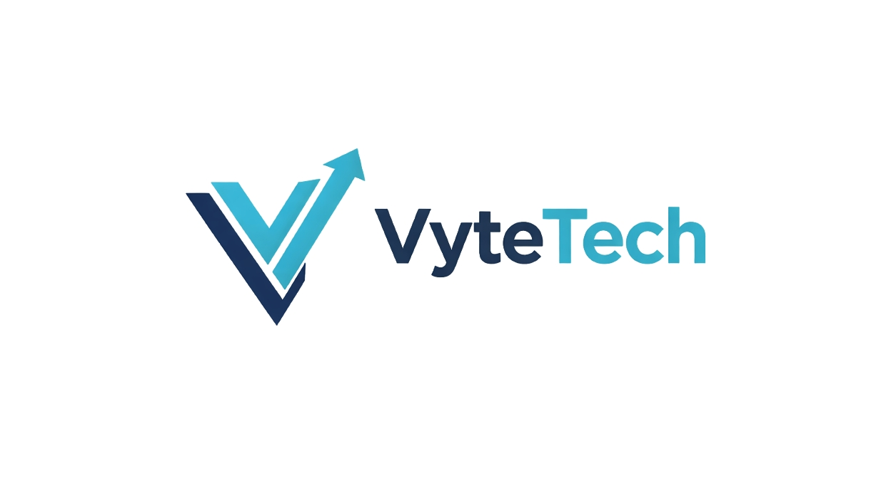

<!-- ========================= -->

<!-- BANNER (SUBSTITUA PELA SUA IMAGEM) -->

<!-- ========================= -->

  

<h1 align="center">VyteTech</h1>

  Engenharia digital estratégica para empresas que querem escalar com eficiência.

  
  
  
  

---

## 🌐 Sobre a VyteTech

A **VyteTech** é uma empresa de engenharia de software especializada na criação de soluções digitais estratégicas para empresas que precisam estruturar operações, automatizar processos e escalar com consistência.

Não desenvolvemos apenas software.
Projetamos **infraestruturas digitais que suportam crescimento real**.

---

## 🎯 Missão

Transformar tecnologia em vantagem competitiva mensurável.

---

## 🔭 Visão

Ser referência em estruturação digital empresarial, entregando sistemas que aumentam eficiência operacional e potencializam crescimento sustentável.

---

## 🧩 O que construímos

* Sistemas empresariais sob medida
* Plataformas web escaláveis
* APIs e integrações complexas
* Automação de processos operacionais
* Estruturação digital organizacional
* Arquitetura de software corporativa
* Modernização de sistemas legados

---

## 🏗 Nossa metodologia

### 1️⃣ Diagnóstico estrutural

Mapeamento de processos, gargalos e oportunidades tecnológicas.

### 2️⃣ Arquitetura da solução

Definição de modelo técnico, escalabilidade e integrações.

### 3️⃣ Desenvolvimento orientado a valor

Construção modular com foco em impacto operacional.

### 4️⃣ Implantação e estabilização

Deploy, monitoramento e validação em ambiente real.

### 5️⃣ Evolução contínua

Otimização baseada em dados e crescimento do negócio.

---

## ⚙ Stack Tecnológica

### Backend — Engenharia robusta e escalável

* Java (ecosistema moderno)
* Spring Boot
* Spring Cloud (arquitetura distribuída)
* APIs REST e arquitetura orientada a serviços
* Microsserviços
* Node.js (serviços leves e integrações)
* Arquitetura orientada a domínio (DDD)

### Frontend — Interfaces modernas e performáticas

* React
* Next.js
* TypeScript
* SSR e SSG
* Design responsivo e componentização escalável

### Banco de Dados — Persistência e modelagem avançada
* Oracle
* PostgreSQL
* MongoDB
* Modelagem relacional e NoSQL
* Otimização de queries e performance

### Infraestrutura e DevOps — Ambientes resilientes

* Containers (Docker)
* Cloud deployment
* Vercel
* CI/CD pipelines
* Monitoramento e observabilidade

### Arquitetura de Software — Engenharia corporativa

* Sistemas modulares e desacoplados
* Escalabilidade horizontal
* Alta disponibilidade
* Resiliência e tolerância a falhas
* Integrações empresariais
* Event-driven architecture (quando necessário)

### Qualidade e Engenharia

* Testes automatizados
* Testes de integração
* Versionamento estruturado
* Boas práticas de engenharia de software

---

## 📂 Projetos e repositórios

Aqui você encontrará:

* Estruturas base de sistemas
* Arquiteturas de referência
* Templates técnicos
* Estudos de engenharia
* Ferramentas internas open source
* Exemplos de integrações complexas

---

## 📈 Filosofia tecnológica

Tecnologia não é custo.
Tecnologia mal aplicada é custo.

Tecnologia estratégica é alavanca de crescimento.

---

## 🤝 Colaboração

Interessado em colaborar, integrar ou desenvolver soluções em conjunto?

Entre em contato.

---

## 🌐 Presença digital

Site: www.vytetech.com
LinkedIn: www.linkedin.com/company/vytetech
Contato comercial: contato@vytetech.com

---

## 👨‍💻 Liderança

Fundação e direção técnica focadas em engenharia de software aplicada a crescimento empresarial.

---

## 🧠 Posicionamento

Empresas que dominam sua estrutura digital dominam sua escala.

A VyteTech projeta essa estrutura.

---

## 📄 Licenciamento

Este perfil e seus repositórios podem conter projetos proprietários e open source.
Verifique a licença específica de cada repositório.

---

  <strong>VyteTech — Digital Engineering for Scalable Business</strong>

